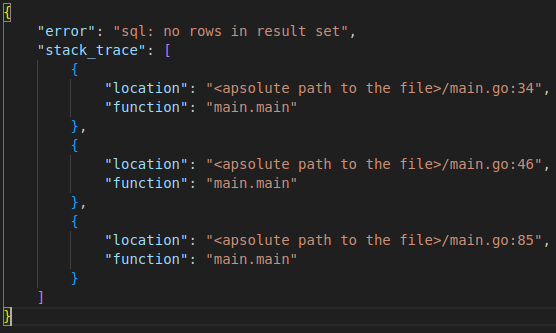

# zerr
Error forwarding package



Example of usage:
```
package main

import (
	"database/sql"
	"fmt"

	"github.com/zmajew/zerr"
	"log"
)

// Function where the error happened
func A() error {
	// Database returned this error on query ...
	return zerr.Forward(sql.ErrNoRows)
}

// Some middle function
func B() error {
	return zerr.Forward(A())
}

func main() {
	err := B()

	// Send an error to the frontend:
	fmt.Println(zerr.WithoutStackTrace(err))

	// Log an error with stack trace:
	log.Fatal(err.Error())
}
```

I have created this small package like a helper and fund it wary useful since it requires less discipline than logging over the code or introducing distributed tracing, for example Jaeger.

In local VS Code usage and debugging just ctrl+click on the location links and trace the error.